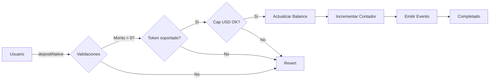

# KipuBankV2 🏦

[](https://soliditylang.org/)
[](https://opensource.org/licenses/MIT)
[](https://openzeppelin.com/)
[](https://chain.link/)

> Sistema bancario descentralizado con soporte multi-token y límites en USD mediante oráculos Chainlink.

## 📋 Tabla de Contenidos

- [Descripción](#-descripción)
- [Características](#-características)
- [Arquitectura](#-arquitectura)
- [Instalación](#-instalación)
- [Uso](#-uso)
- [Funciones Principales](#-funciones-principales)
- [Seguridad](#-seguridad)
- [Configuración](#-configuración)
- [Testing](#-testing)
- [Despliegue](#-despliegue)
- [Mejoras Futuras](#-mejoras-futuras)
- [Contribuir](#-contribuir)
- [Licencia](#-licencia)
- [Autor](#-autor)

## 🎯 Descripción

**KipuBankV2** es un contrato inteligente de banca descentralizada que permite a los usuarios depositar y retirar tanto ETH nativo como tokens ERC-20. El contrato implementa límites de depósito y retiro denominados en USD utilizando oráculos de precios de Chainlink para garantizar la seguridad y el control de riesgos.

### ¿Por qué KipuBankV2?

- 💰 **Límites en USD**: Protección contra volatilidad con límites en moneda fiat
- 🔒 **Multi-capa de seguridad**: ReentrancyGuard, Pausable, y Ownable de OpenZeppelin
- 🪙 **Multi-token**: Soporte para ETH nativo y tokens ERC-20
- 📊 **Oracle Integration**: Precios en tiempo real vía Chainlink
- 🎯 **Gas optimizado**: Uso de `unchecked` y SafeERC20

## ✨ Características

### Funcionalidades Core

- ✅ **Depósitos de ETH nativo** con validación de límites en USD
- ✅ **Depósitos de tokens ERC-20** con cálculo preciso de montos recibidos
- ✅ **Retiros con límites por transacción** en USD
- ✅ **Balance por usuario y por token** con tracking granular
- ✅ **Administración de tokens soportados** por el owner
- ✅ **Sistema de pausado de emergencia**
- ✅ **Función receive() para depósitos directos**
- ✅ **Estadísticas del banco** (total de depósitos/retiros)

### Seguridad

- 🛡️ **ReentrancyGuard**: Protección contra ataques de reentrada
- ⏸️ **Pausable**: Capacidad de pausar operaciones en emergencias
- 👑 **Ownable**: Control de acceso para funciones administrativas
- 🔐 **SafeERC20**: Transferencias seguras de tokens
- 🚨 **Custom Errors**: Errores específicos para debugging eficiente
- ✔️ **Modifiers personalizados**: Validaciones inline

## 🏗️ Arquitectura

```
KipuBankV2
├── Herencias
│   ├── Ownable (OpenZeppelin)
│   ├── Pausable (OpenZeppelin)
│   └── ReentrancyGuard (OpenZeppelin)
│
├── Estado Inmutable
│   ├── i_priceFeed (Chainlink AggregatorV3Interface)
│   ├── i_bankCapUSD (Límite máximo de depósitos)
│   └── i_withdrawalLimitUSD (Límite por retiro)
│
├── Estado Mutable
│   ├── s_userBalances (mapping: user => token => balance)
│   ├── s_isTokenSupported (mapping: token => bool)
│   ├── s_totalDeposits (contador)
│   └── s_totalWithdrawals (contador)
│
└── Funciones
    ├── Depósitos (depositNative, depositToken)
    ├── Retiros (withdrawNative, withdrawToken)
    ├── Administración (supportNewToken, removeTokenSupport)
    ├── Control (pauseBank, unpauseBank)
    └── Vistas (getBalance, getETHPrice, etc.)
```

### Flujo de Depósito (ETH)



## 📦 Instalación

### Prerrequisitos

- Node.js v16+ y npm/yarn
- Foundry o Hardhat
- Una wallet con fondos para gas

### Clonar el Repositorio

```bash
git clone https://github.com/tu-usuario/kipubank-v2.git
cd kipubank-v2
```

### Instalar Dependencias

#### Con Foundry

```bash
forge install OpenZeppelin/openzeppelin-contracts
forge install smartcontractkit/chainlink
```

#### Con Hardhat

```bash
npm install
# o
yarn install
```

### Variables de Entorno

Crear un archivo `.env`:

```env
PRIVATE_KEY=tu_private_key
ETHERSCAN_API_KEY=tu_api_key
SEPOLIA_RPC_URL=https://sepolia.infura.io/v3/tu_project_id
MAINNET_RPC_URL=https://mainnet.infura.io/v3/tu_project_id

# Parámetros del contrato
BANK_CAP_USD=1000000000000  # $10,000 con 8 decimales
WITHDRAWAL_LIMIT_USD=100000000000  # $1,000 con 8 decimales
PRICE_FEED_ADDRESS=0x694AA1769357215DE4FAC081bf1f309aDC325306  # ETH/USD Sepolia
```

## 🚀 Uso

### Desplegar el Contrato

#### Con Foundry

```bash
forge script script/Deploy.s.sol:DeployKipuBank --rpc-url $SEPOLIA_RPC_URL --broadcast --verify
```

#### Con Hardhat

```bash
npx hardhat run scripts/deploy.js --network sepolia
```

### Interactuar con el Contrato

#### Depositar ETH

```solidity
// Opción 1: Función depositNative()
await kipuBank.depositNative({ value: ethers.parseEther("1.0") });

// Opción 2: Envío directo (via receive)
await signer.sendTransaction({
    to: kipuBankAddress,
    value: ethers.parseEther("1.0")
});
```

#### Depositar Tokens ERC-20

```solidity
// 1. Aprobar tokens
await token.approve(kipuBankAddress, amount);

// 2. Depositar
await kipuBank.depositToken(tokenAddress, amount);
```

#### Retirar Fondos

```solidity
// Retirar ETH
await kipuBank.withdrawNative(ethers.parseEther("0.5"));

// Retirar tokens
await kipuBank.withdrawToken(tokenAddress, amount);
```

#### Consultar Balance

```solidity
// Balance propio
const myBalance = await kipuBank.getMyBalance(tokenAddress);

// Balance de otro usuario
const userBalance = await kipuBank.getBalance(userAddress, tokenAddress);
```

### Funciones Administrativas (Solo Owner)

```solidity
// Agregar soporte para un nuevo token
await kipuBank.supportNewToken(newTokenAddress);

// Remover soporte de un token
await kipuBank.removeTokenSupport(tokenAddress);

// Pausar el banco
await kipuBank.pauseBank();

// Reanudar operaciones
await kipuBank.unpauseBank();
```

## 📚 Funciones Principales

### Funciones Públicas/Externas

| Función | Tipo | Descripción | Restricciones |
|---------|------|-------------|---------------|
| `depositNative()` | External Payable | Deposita ETH nativo | whenNotPaused, nonReentrant |
| `depositToken(address, uint256)` | External | Deposita tokens ERC-20 | whenNotPaused, nonReentrant |
| `withdrawNative(uint256)` | External | Retira ETH nativo | nonReentrant, límite USD |
| `withdrawToken(address, uint256)` | External | Retira tokens ERC-20 | nonReentrant |
| `supportNewToken(address)` | External | Habilita nuevo token | onlyOwner |
| `removeTokenSupport(address)` | External | Deshabilita token | onlyOwner |
| `pauseBank()` | External | Pausa operaciones | onlyOwner |
| `unpauseBank()` | External | Reanuda operaciones | onlyOwner |

### Funciones de Vista

| Función | Retorno | Descripción |
|---------|---------|-------------|
| `getBalance(address, address)` | uint256 | Balance de usuario para un token |
| `getMyBalance(address)` | uint256 | Balance propio para un token |
| `getBankCapUSD()` | uint256 | Límite máximo de depósitos en USD |
| `getWithdrawalLimitUSD()` | uint256 | Límite por retiro en USD |
| `getPriceFeed()` | address | Dirección del oracle de Chainlink |
| `isTokenSupported(address)` | bool | Verifica si un token es soportado |
| `getBankStats()` | (uint256, uint256) | Total de depósitos y retiros |
| `getETHPrice()` | uint256 | Precio actual de ETH en USD (8 decimales) |

### Eventos

```solidity
event Deposit(address indexed user, address indexed token, uint256 amount, uint256 valueUSD);
event Withdrawal(address indexed user, address indexed token, uint256 amount, uint256 valueUSD);
event TokenSupported(address indexed token);
event TokenRemoved(address indexed token);
```

### Errores Personalizados

```solidity
error KipuBank__ZeroAmount();
error KipuBank__ZeroAmountDeposit();
error KipuBank__ZeroAmountWithdrawal();
error KipuBank__InsufficientBalance();
error KipuBank__BankCapExceeded(uint256 current, uint256 attempted, uint256 cap);
error KipuBank__WithdrawalLimitExceeded(uint256 amount);
error KipuBank__TransferFailed();
error KipuBank__OracleFailed();
error KipuBank__TokenNotSupported(address token);
error KipuBank__UseDepositNative();
error KipuBank__UseWithdrawNative();
error KipuBank__CannotRemoveNativeToken();
```

## 🔒 Seguridad

### Auditorías

⚠️ **Este contrato NO ha sido auditado profesionalmente**. Use bajo su propio riesgo.

### Consideraciones de Seguridad

#### ✅ Implementadas

- Protección contra reentrancy en todas las funciones externas
- Checks-Effects-Interactions pattern
- SafeERC20 para prevenir transferencias fallidas
- Custom errors para gas optimization
- Validación de precios del oracle (price > 0)

#### ⚠️ Limitaciones Conocidas

1. **Oracle de precios solo para ETH**: Los tokens ERC-20 no tienen conversión a USD
2. **Sin validación de freshness del oracle**: No se verifica `updatedAt`
3. **Función receive() sin pausa**: Los depósitos directos ignoran el pausado
4. **Sin emergency withdrawal**: Durante pausa, los fondos quedan bloqueados
5. **Centralización**: El owner tiene control total (pausar, tokens soportados)

### Mejores Prácticas para Usuarios

- ✅ Siempre verifica que el token esté soportado antes de depositar
- ✅ Consulta los límites USD antes de operar
- ✅ Usa `getMyBalance()` para verificar tu saldo
- ✅ Considera los fees de gas para operaciones pequeñas
- ⚠️ No envíes tokens directamente sin usar `depositToken()`

## ⚙️ Configuración

### Parámetros de Despliegue

```solidity
constructor(
    uint256 _bankCapUSD,           // Ej: 10_000 * 10**8 = $10,000
    uint256 _withdrawalLimitUSD,   // Ej: 1_000 * 10**8 = $1,000
    address _priceFeedAddress      // Oracle de Chainlink ETH/USD
)
```

### Direcciones de Oracles Chainlink

| Red | Par | Dirección |
|-----|-----|-----------|
| Ethereum Mainnet | ETH/USD | `0x5f4eC3Df9cbd43714FE2740f5E3616155c5b8419` |
| Sepolia Testnet | ETH/USD | `0x694AA1769357215DE4FAC081bf1f309aDC325306` |
| Arbitrum One | ETH/USD | `0x639Fe6ab55C921f74e7fac1ee960C0B6293ba612` |
| Polygon | ETH/USD | `0xF9680D99D6C9589e2a93a78A04A279e509205945` |

Consulta [Chainlink Data Feeds](https://docs.chain.link/data-feeds/price-feeds/addresses) para más redes.

## 🧪 Testing

### Ejecutar Tests

```bash
# Foundry
forge test
forge test --match-test testDepositNative -vvv

# Hardhat
npx hardhat test
npx hardhat test --grep "deposit"
```

### Coverage

```bash
# Foundry
forge coverage

# Hardhat
npx hardhat coverage
```

### Ejemplo de Test

```solidity
function testDepositNativeSuccess() public {
    uint256 depositAmount = 1 ether;
    
    vm.deal(user, depositAmount);
    vm.prank(user);
    
    kipuBank.depositNative{value: depositAmount}();
    
    uint256 balance = kipuBank.getBalance(user, NATIVE_TOKEN);
    assertEq(balance, depositAmount);
}
```

## 🚢 Despliegue

### Checklist Pre-Despliegue

- [ ] Tests pasando con 100% coverage
- [ ] Variables de entorno configuradas
- [ ] Dirección del oracle verificada para la red objetivo
- [ ] Límites USD calculados correctamente (recuerda los 8 decimales)
- [ ] Owner address confirmada
- [ ] Gas price aceptable

### Redes Soportadas

- ✅ Ethereum Mainnet
- ✅ Ethereum Sepolia
- ✅ Arbitrum One
- ✅ Polygon
- ✅ Optimism
- ✅ Base

### Verificación en Etherscan

```bash
# Foundry
forge verify-contract <CONTRACT_ADDRESS> KipuBankV2 \
    --constructor-args $(cast abi-encode "constructor(uint256,uint256,address)" $BANK_CAP $WITHDRAWAL_LIMIT $PRICE_FEED) \
    --etherscan-api-key $ETHERSCAN_API_KEY

# Hardhat
npx hardhat verify --network sepolia <CONTRACT_ADDRESS> "1000000000000" "100000000000" "0x694AA1769357215DE4FAC081bf1f309aDC325306"
```

## 🔮 Mejoras Futuras

### Roadmap v3.0

- [ ] **Multi-oracle support**: Oracles para tokens ERC-20
- [ ] **Time-weighted USD limits**: Límites diarios/semanales
- [ ] **Yield generation**: Integración con protocolos DeFi (Aave, Compound)
- [ ] **NFT receipts**: NFTs representando depósitos
- [ ] **Governance token**: Token $KIPU para voting
- [ ] **Emergency withdrawal**: Retiros parciales durante pausa
- [ ] **Multi-sig ownership**: Reducir centralización
- [ ] **L2 optimization**: Versiones específicas para L2s
- [ ] **Cross-chain bridge**: Depósitos cross-chain
- [ ] **Staking rewards**: Recompensas por depositar

### Optimizaciones Técnicas

- [ ] Implementar upgradability (UUPS o Transparent Proxy)
- [ ] Batch operations para múltiples tokens
- [ ] Oracle freshness validation
- [ ] Circuit breakers para precios
- [ ] Gas optimization con assembly
- [ ] EIP-2612 permit para approvals

## 🤝 Contribuir

¡Las contribuciones son bienvenidas! Por favor sigue estos pasos:

1. Fork el proyecto
2. Crea una rama para tu feature (`git checkout -b feature/AmazingFeature`)
3. Commit tus cambios (`git commit -m 'Add some AmazingFeature'`)
4. Push a la rama (`git push origin feature/AmazingFeature`)
5. Abre un Pull Request

### Guías de Contribución

- Escribe tests para nuevas funcionalidades
- Mantén coverage > 90%
- Sigue el estilo de código existente
- Documenta funciones con NatSpec
- Actualiza el README si es necesario

## 📄 Licencia

Este proyecto está licenciado bajo la Licencia MIT - ver el archivo [LICENSE](LICENSE) para detalles.

```
MIT License

Copyright (c) 2025 Marcelo Walter Castellan

Permission is hereby granted, free of charge, to any person obtaining a copy
of this software and associated documentation files (the "Software"), to deal
in the Software without restriction...
```

## 👨‍💻 Autor

**Marcelo Walter Castellan**

- GitHub: [@tu-usuario](https://github.com/tu-usuario)
- LinkedIn: [Tu Perfil](https://linkedin.com/in/tu-perfil)
- Twitter: [@tu-handle](https://twitter.com/tu-handle)
- Email: tu-email@example.com

## 🙏 Agradecimientos

- [OpenZeppelin](https://openzeppelin.com/) por las librerías de contratos
- [Chainlink](https://chain.link/) por los oracles de precios
- [Foundry](https://getfoundry.sh/) / [Hardhat](https://hardhat.org/) por las herramientas de desarrollo
- Comunidad de Ethereum por el soporte

## 📊 Estadísticas del Proyecto


---

⭐ Si este proyecto te resultó útil, considera darle una estrella en GitHub!

**Desarrollado con ❤️ por la comunidad Web3**